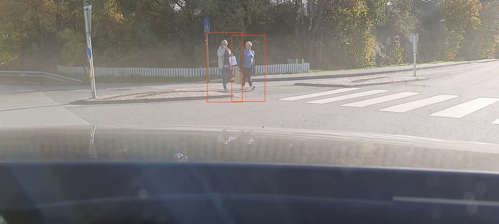
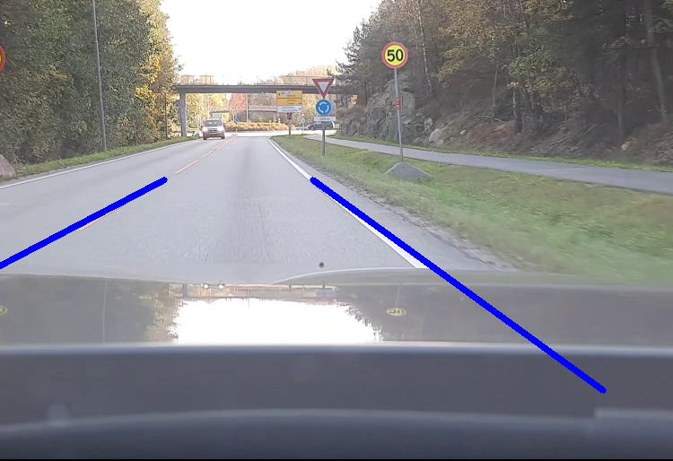
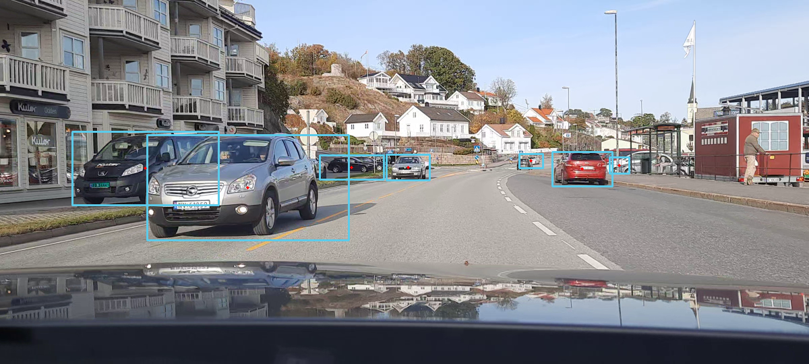
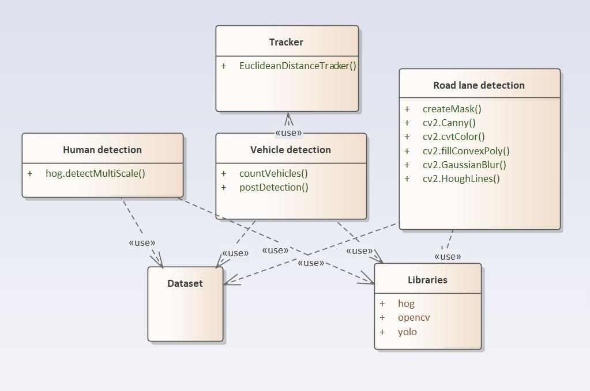

# Object Detection in Autonomous Vehicles

## Introduction

In this project, our goal is to write software that can detect humans, vehicle, roadlane from an autonomous vehicle's perspective.

## Result

**Human Detection**:  


**Roadlane Detection**:  


**Vehicle Detection**:  



## Team

**Group**: 22  
**Members**: Sriram Akella, Hana Myre, Martin Mollestad, Morteza Haidari,

## Project Structure

```
.
├── .gitignore
├── data
│  ├── CarPOV_h-detect.mp4
│  ├── CarPOV_roadlane.mp4
│  ├── CarPOV_v-detect.mp4
│  ├── coco.names
│  ├── extra
│  ├── yolov3-320.cfg
│  └── yolov3-320.weights
├── notes.md
├── output
│  ├── v-detect
│  └── vehicle_detection_v3.mp4
├── ReadMe.md
└── src
   ├── demo.sh
   ├── extra
   ├── human-detect.py
   ├── humanDetact.py
   ├── roadlane.py
   ├── tracker.py
   └── vehicle_detect.py
```

### Folders:

- **Src** - Folder where our source code is located
  - extra - This folder contains code that were unnecessary for final result, but were used for early versions.
- **Data** - This folder contains our datasets, such as videos and images.
  - extra - This folder contains datasets that were unnecessary for final result, but were used for early versions.
- **Output** - This directory contains output files from code. **NOTE: This folder contains files that were not used in the final version.**

### Files:

The follow files were used to achieve project goals:

#### **Human Detections:**  
   - [human-detect.py](src/human-detect.py)

#### **Roadlane Detections:**   
  -  [roadlane.py](src/roadlane.py)

#### **Vehicle Detections:**  
  - [tracker.py](src/tracker.py)
  - [vehicle_detect.py](src/vehicle_detect.py)

## System Design



## Prerequisite

```
- Python>=3.8
- imutils==0.5.4
- matplotlib==3.4.3
   - cycler [required: >=0.10, installed: 0.11.0]
   - kiwisolver [required: >=1.0.1, installed: 1.3.2]
   - numpy [required: >=1.16, installed: 1.21.4]
   - pillow [required: >=6.2.0, installed: 8.4.0]
   - pyparsing [required: >=2.2.1, installed: 3.0.5]
   - python-dateutil [required: >=2.7, installed: 2.8.2]
      - six [required: >=1.5, installed: 1.16.0]
- opencv-python==4.5.4.58
   - numpy [required: >=1.17.3, installed: 1.21.4]
- scipy==1.7.2
   - numpy [required: >=1.16.5,<1.23.0, installed: 1.21.4]
```

## Usage

```{bash}
cd src
bash demo.sh or ./demo.sh
```


## FAQ

1. Why is the repo called hbd?

- Originally, we thought of human detection, i.e human body detection = hbd. After our first presentation, we moved to **Object detection in autonomous vehicles**.
